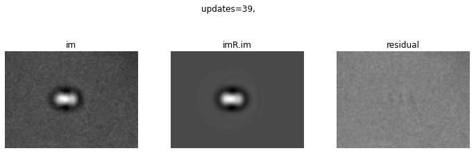
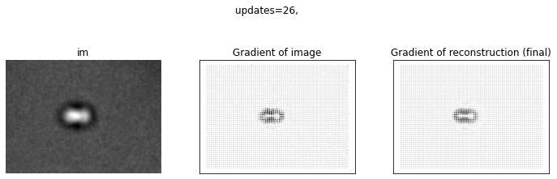
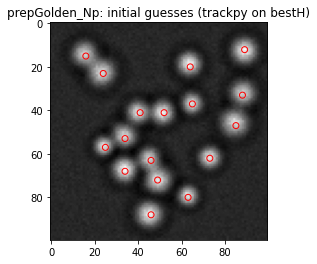
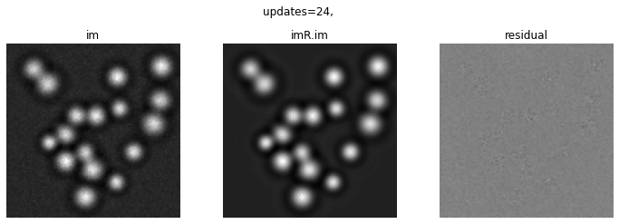

# PyAimRec

## Particle tracking via Adaptive Image Reconstruction

PyAimRec is a Python package for adaptive image-reconstruction–based tracking of spherical colloids in bright-field microscopy images, with a particular focus on situations where particle images strongly overlap and conventional centroid or threshold-based tracking fails.

The method represents each particle by a learned, radially symmetric shape function and iteratively reconstructs the full image from particle positions and shapes. Particle positions are refined through optimisation of the reconstruction error, while particle shapes are updated self-consistently from image residuals. This adaptive procedure enables nanometre-precision localisation even under severe image overlap.

In addition to tracking particle positions, PyAimRec can resolve time-dependent changes in particle shape, making it suitable for studying stimuli-responsive or dynamically evolving colloids. The framework supports both intensity-based and gradient-based reconstruction models and is well suited for quantitative applications such as interparticle distance measurements, interaction-potential extraction, and optical-tweezers experiments involving closely spaced colloidal particles.

It supports two complementary reconstruction engines:

Intensity-based reconstruction (AimRecIntensity)

Gradient-based reconstruction (AimRecGradient)

A lightweight wrapper class (AimRec) provides a unified user-facing interface while keeping all algorithmic logic inside the engine classes.


## Key Features

Adaptive reconstruction of particle images using learned radial shape functions

Robust tracking under particle overlap

Two interchangeable reconstruction modalities:

Intensity (pixel residual–based)

Gradient (vector field–based, baseline-free)

Iterative shape refinement during tracking

Golden-section search–based position optimisation


## Installation

Requirements

Python ≥ 3.10

### Install from GitHub (recommended)

Install the latest version directly from GitHub:

```md
pip install git+https://github.com/genglaodemao/PyAimRec.git
```

### Install from source (development mode)

Clone the repository and install in editable mode:

```md
git clone https://github.com/genglaodemao/PyAimRec.git

cd PyAimRec

pip install -e .
```

### Verify installation

```python
from PyAimRec import AimRec
```
If the import succeeds, PyAimRec is installed correctly.


## Basic Usage - 2 particles

Below, we show the basic usage of AimRec using an example obtained from optical tweezers potential measurements. Two pNIPAM microgel particles were captured and slighty pushed against each other, resulting in strong image overlap.

### Intensity-based reconstruction

```python
from PyAimRec import AimRec

from tifffile import imread
from scipy.io import loadmat


im = imread("image_2.tif") #load image

bg_mat = loadmat("BG.mat") #load background (.mat from matlab saved matrix in this case)
BG = bg_mat.get("BG", None)

im = im - BG #remove background

#--- reconstruction ----

rec = AimRec(
    im=im,
    mode="intensity",
    kwargs=dict(
        invert=True,
        ifbaseline=True,
        Gkernel=0.5,
        Rcut=25,
    ),
)

rec.run()

rec.plot()

#--- summary ---
rec.summary(px_to_nm=73.8)
```
It returns (number could change)

 Adaptive Reconstruction Summary
 
✔ Reconstruction finished.

Baseline  : 8.178879e+01

Converge: Reach Plateau.

Iterations        : 37

Shape updates     : 39

Final error (er)  : 2.925491e+01

Final particle positions (pixels):

  Particle  1 : x =   43.891, y =   36.882
  
  Particle  2 : x =   51.095, y =   37.126

Interparticle distance:

  Distance (px)   : 7.2081
  
  Distance (nm)   : 532.74

with the following plot



### Gradient-based reconstruction

```python
from PyAimRec import AimRec

from tifffile import imread
from scipy.io import loadmat


im = imread("image_2.tif") #load image

bg_mat = loadmat("BG.mat") #load background (.mat from matlab saved matrix in this case)
BG = bg_mat.get("BG", None)

im = im - BG #remove background

#--- reconstruction ----

rec = AimRec(
    im=im,
    mode="gradient",
    kwargs=dict(
        invert=True,
        ifbaseline=True,
        Gkernel=0.5,
        Rcut=25,
    ),
)

rec.run()

rec.plot()

#--- summary ---
rec.summary(px_to_nm=73.8)
```
It returns (number could change)

 Adaptive Reconstruction Summary
 
✔ Reconstruction finished.

Baseline  : 8.178879e+01

Converge: Reach Plateau.

Iterations        : 25

Shape updates     : 26

Final error (er)  : 2.641208e+01

Final particle positions (pixels):

  Particle  1 : x =   43.772, y =   36.911
  
  Particle  2 : x =   50.968, y =   37.111

Interparticle distance:

  Distance (px)   : 7.1987
  
  Distance (nm)   : 531.27

with the following plot



### Refinement (optional)

After a full reconstruction, it is often useful to reapeat the reconstruction, starting with the learned shape and re-optimise positions.

Both engines implement run_shape() for this purpose, and the wrapper exposes it directly.

Default behaviour

```python
rec.run_shape(step=0.5, do_plot=True)
```

This enforces internally:

intensity mode:

S = S_accept

PosGuess = Pos_final

gradient mode:

gr = gr_accept

PosGuess = Pos_final


## Basic Usage - multi particles

Below, we show the basic usage of AimRec using an example image of polydispersy microgel particles adsorbed on a coverslip.

### Intensity-based reconstruction

```python
from PyAimRec import AimRec

from tifffile import imread

im = imread("image_multi.tif") #load image

#--- reconstruction ----

rec = AimRec(
    im=im,
    mode="intensity",
    kwargs=dict(
        ifbaseline=True,
        ifplot=True,
        ifplot_init=True,
        masscut=520,
        Gkernel=0,
        Rguess=2.5,
        Rcut=18,
        plateau_tol=1e-3,
        step_min=1e-3,
    ),
)

rec.run()

#--- summary ---
rec.summary(px_to_nm=73.8)
```

It starts with showing the trackpy guess (initial guess). 

**Notice that initial guess must contain all candidate. If not, optimise the trackpy parameter first.**



It returns (number could change)

 Adaptive Reconstruction Summary
 
✔ Reconstruction finished.

Baseline  : 3.735762e+01

Converge: Reach minimal searching step.

Iterations        : 23

Shape updates     : 24

Final error (er)  : 1.815220e+01

Final particle positions (pixels):

  Particle  1 : x =   15.490, y =   14.265
  
  Particle  2 : x =   23.090, y =   22.419
  
  Particle  3 : x =   24.355, y =   56.400

  ......
  
with the following plot



### Gradient-based reconstruction

```python
from PyAimRec import AimRec

from tifffile import imread

im = imread("image_multi.tif") #load image

#--- reconstruction ----

rec = AimRec(
    im=im,
    mode="gradient",
    kwargs=dict(
        ifbaseline=True,
        ifplot=True,
        ifplot_init=True,
        masscut=520,
        Gkernel=0,
        Rguess=2.5,
        Rcut=18,
        plateau_tol=1e-3,
        step_min=1e-3,
    ),
)

rec.run()

#--- summary ---
rec.summary(px_to_nm=73.8)
```
It starts with showing the same trackpy guess (initial guess). 

**Notice that initial guess must contain all candidate. If not, optimise the trackpy parameter first.**

It returns (number could change)

 Adaptive Reconstruction Summary

✔ Reconstruction finished.

Converge: Reach Plateau.

Iterations        : 23

Shape updates     : 24

Final error (er)  : 1.842526e+01

Final particle positions (pixels):

  Particle  1 : x =   15.493, y =   14.271
  
  Particle  2 : x =   23.102, y =   22.420
  
  Particle  3 : x =   24.366, y =   56.418

  ......

with the following plot


## Tests / Example Scripts

### Examples

The examples/ directory contains runnable scripts and images demonstrating shown in this notebook:

### tests

The tests/ directory contains runnable scripts demonstrating and validating the algorithms:

```python
python tests/Runme_AimRec.py

python tests/Runme_Multi.py
```

These scripts serve as:

usage examples

regression tests

debugging / development entry points

They are intentionally verbose and explicit.


## Design Philosophy

Engines own behaviour

AimRecIntensity and AimRecGradient contain all algorithmic logic.

Wrapper routes only

AimRec does not modify state or logic — it only delegates calls.

Explicit over implicit

No hidden state resets. Every workflow step is visible and controllable.

Research-first API

The code prioritises transparency and hackability over consumer convenience.


## Typical Use Cases

Overlapping colloidal particles 

Optical tweezers potential measurements

Thermoresponsive microgels

Active or driven particle systems

High-precision interparticle distance measurements


## Notes

**PyAimRec is not responsible for particle detection or identification.**

The algorithm starts from initial position estimates provided by "trackpy". These initial estimates must include all and only the true particle candidates present in the image. If particles are missed or spurious candidates are included, users should optimise the detection parameters of the upstream tool before running PyAimRec.

PyAimRec assumes approximate radial symmetry and a reasonable signal-to-noise ratio. Convergence and performance depend on the quality of the initial position estimates and on the chosen reconstruction modality (intensity or gradient).


## Citation

If you use PyAimRec in scientific work, please cite the associated methodological publication (in preparation).
